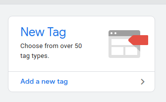
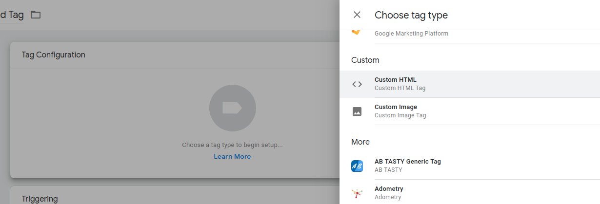
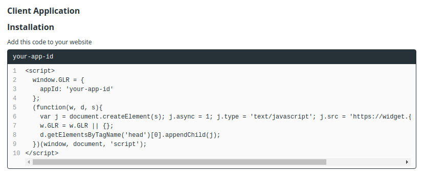
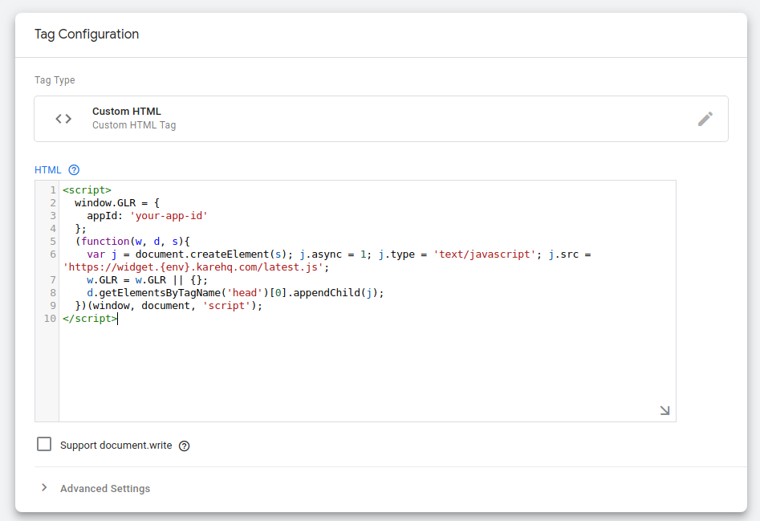
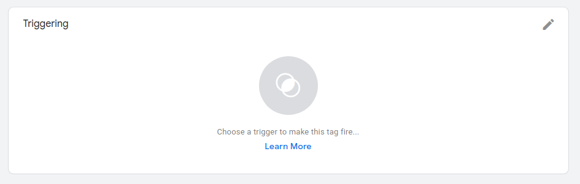

# Google Tag Manager

You can load our widget using Google Tag Manager by creating a new tag that includes our script.

First you have to add a new tab:

Then you need to click on Tag Configuration and select Custom HTML:

Then you can use the `<script>` tag we provide in the console (inside Settings -> Widget) and paste it there:

After that, you can just use the triggers you want to load our widget:

