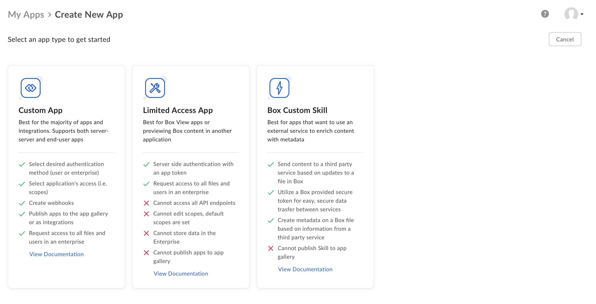
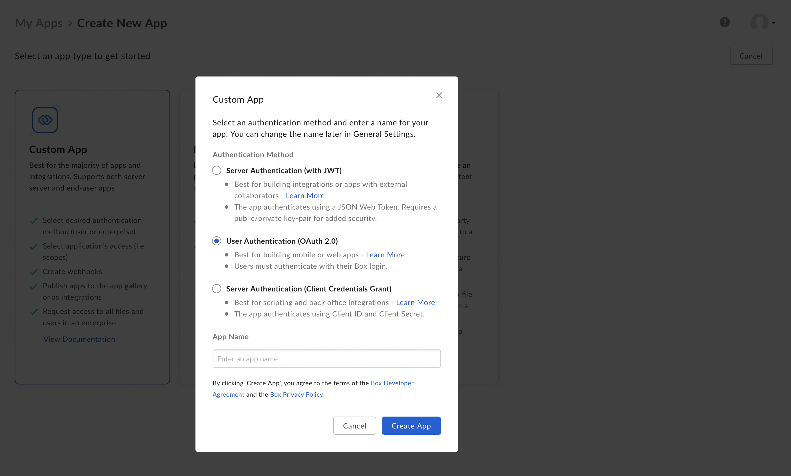
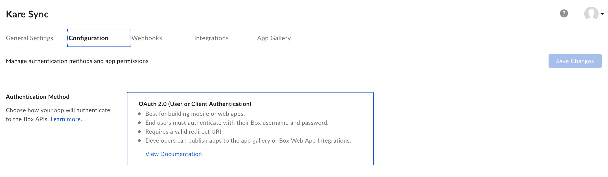
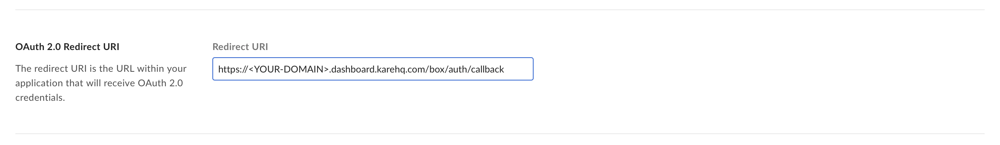
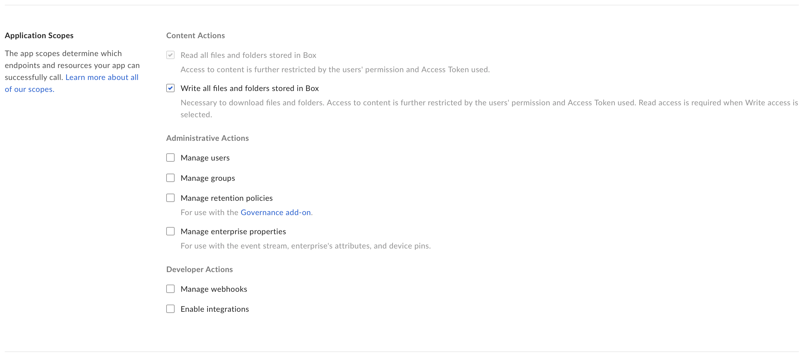
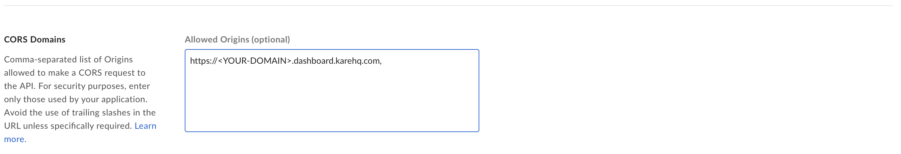
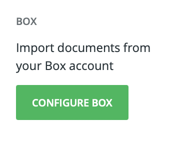
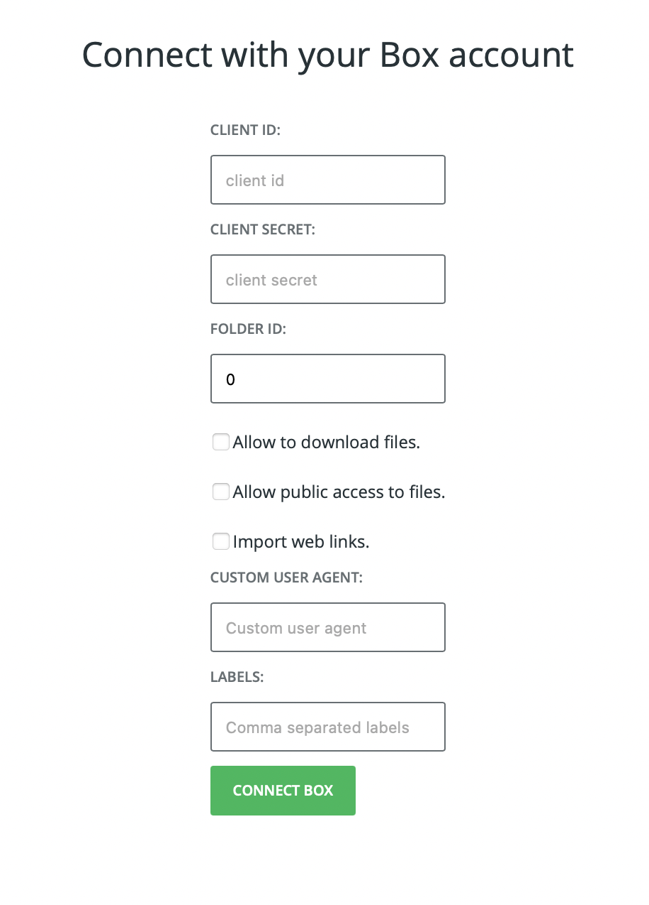

# Connecting a Box account

This step to step guide explains how to connect a Box account to your KARE knowledgebase.

## Create a new Box application (Step 1/3)

Navigate to your [Box developer console](https://app.box.com/developers/console) and create a new client application by clicking on the _Create New App_ button.

The choose _Custom App_ from the list of possible applications. Custom applications are the most common and the most powerful.

Finally, select _OAuth 2.0_ as authentication method and name your application in a memorable way, for instance _KARE sync_.

Congratulations, you have just created a Box app!

## Configure your new Box application (Step 2/3)

Open your Box application and navigate to the _Configuration_ tab. If the App was created correctly you should see _OAuth 2.0_ as authentication method.

Now you will need the URL of your KARE dashboard. You can copy that from the browser URL tab once you are signed-in in the KARE dashboard. It should be something like `https://<YOUR-DOMAIN>.dashboard.karehq.com`. The first word in the URL is your domain. 

In _OAuth 2.0 Redirect URI_ type the following URL by replacing your domain in the tamplate: `https://<YOUR-DOMAIN>.dashboard.karehq.com/box/auth/callback`.

If you make a mistake, don't worry, Box will tell you by highlighting the text field in red.

In _Application Scopes_ selects _Write all files and folders stored in Box_. KARE needs that permission to share your files if needed. 

Finally add `https://<YOUR-DOMAIN>.dashboard.karehq.com/box/auth/callback` in _CORS Domains_. Please make sure to write your domain name exacly as you did above.

Don't forget to save!

In the middle of the page there should be a box indicating _Client ID_ and _Client Secret_, you will need them in the next step.

## Authorize your Kare account (Step 3/3)

Open the KARE dashboard and navigate to _Data Import_ tab of the settings page. Only administrators can access it.
Once you are there click on _Configure Box_.

From this settings page you can now configure KARE to import and use content from Box. It is really important that you configure it properly because this will configure what Kare will do with your files.

Let's explain the various parameters:
 *  **Client ID** and **Client Secret** are the OAuth 2.0 credentials that KARE will use to connect. You can find them in the _Configuration_ page od the Box App that we just created.  A user will need to authorize the connection once you press on the _Connect Box_ button at the bottom of the form.
 * **Folder ID** is the ID of the Box folder that KARE will import. It's the long number that appears in the URL bar of your browser when you are navigating a Box folder. If you leave `0` KARE will import everythign in your Box account, normally this is not what you will want to do.
 * **Allow to download files** configure KARE to allow users to download files or to just let them access them online through Box.
 * **Allow public access to files** by default only Box users in your organization will have access to Box files. Click this option if you want KARE to share them publicly.
 * **Import web links** configure KARE to import all web links which are bookmarked in your Box account.
 * **Custom user agent** when donwloading a web page KARE introduces itself to the website as `KareBot`. If you need you can change this.
 * **labels** configure KARE to label all resources imported from Box with the following lables. They must be comma separated like `tutorial,customer-engagement,lead-gen`.

 Once you press connect Box will handle the authentication process and, if the process is succesfull, your files will appear in KARE.
